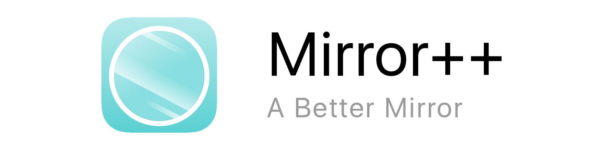

# Overview
Mirror++ is a minimalist non-reversing mirror app for the iPhone, written in Swift.

# Installation 

Coming soon...

# FAQ

**"Why isn't this on the App Store?"**

Apple rejected Mirror++ because they found it in violation of [guideline 2.11](https://developer.apple.com/app-store/review/guidelines/#functionality): 

> Apps that duplicate Apps already in the App Store may be rejected, particularly if there are many of them, such as fart, burp, flashlight, and Kama Sutra Apps

I personally disagree with this decision as I believe Mirror++ is better than most mirror apps currently on the App Store, but I understand Apple's reasoning. You can still run Mirror++ by downloading and compiling the code yourself!

# License 

Mirror++ is available under the [MIT License](LICENSE).

# Contributors

* [Nathan Smith](https://github.com/nathunsmitty)
